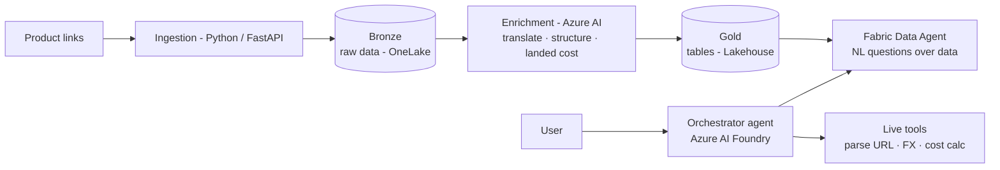

# roadmap-ai

> An AI shopping copilot for **kakobuy** hauls — give it a few product links and ask anything about price, specs, and which item is the best buy.

`roadmap-ai` is a hands-on project for learning **AI / Gen-AI software engineering**. It is built around a real, practical problem: deciding what to buy through [kakobuy](https://www.kakobuy.com/), a buying agent that purchases from Chinese marketplaces (Taobao, Weidian, 1688) and ships internationally.

You hand the assistant a short list of product links, and it answers natural-language questions about them — prices, characteristics, recommendations — and ultimately helps decide **which product is the best choice for you**.

---

## What it does

- Accepts a small list of product links from kakobuy / Taobao / Weidian / 1688.
- Extracts and structures each product (title, price in CNY, options, images, seller).
- Translates Chinese product data into English / Spanish.
- Estimates the **total landed cost to Chile** (item + domestic CN shipping + agent fee + international shipping by weight + IVA / customs).
- Answers questions in natural language and recommends the best product for a given need.

## Example questions

- "Which of these is the cheapest once shipped to Chile?"
- "Compare the two hoodies — material, available sizes, total cost."
- "Which item is the best value for a winter jacket under $60?"
- "Which products go over the de minimis customs threshold?"

---

## Architecture

A small **multi-agent** system on top of a **medallion** data pipeline:

- **Bronze (ingestion):** Python service extracts raw product data and stores it in OneLake.
- **Gold (enrichment):** Azure AI translates, structures, and computes landed cost into clean Lakehouse **tables**.
- **Conversational layer:** a Microsoft Fabric **Data Agent** answers natural-language questions over the Gold tables (NL2SQL).
- **Orchestrator:** an Azure AI agent with tool-calling that combines the Fabric Data Agent (questions about the dataset) with live tools (parse a new link, convert currency, recompute cost).

## Tech stack

| Layer | Technology |
|-------|-----------|
| Language | Python |
| API / service | FastAPI on Azure Container Apps (or Azure Functions) |
| AI services | Azure OpenAI, Azure AI Translator |
| Agent orchestration | Azure AI Foundry / Agent Service |
| Data platform | Microsoft Fabric — OneLake Lakehouse + Data Agent |
| Analytics (optional) | PySpark notebooks + Power BI |

---

## Roadmap

**Phase 0 — Foundations (study)**
- [ ] Python for AI engineering refresh (typing, async, FastAPI, testing)
- [ ] Prompt engineering + tool calling fundamentals
- [ ] Azure OpenAI + Microsoft Fabric trial set up

**Phase 1 — MVP: conversational landed-cost calculator**
- [ ] Landed-cost logic for Chile (item + shipping + agent fee + IVA / de minimis)
- [ ] Single agent with tool calling that explains and runs the calculation

**Phase 2 — Ingestion + data pipeline**
- [ ] Parse a product link into structured data (Bronze)
- [ ] Translate + enrich + write Gold tables in the Lakehouse

**Phase 3 — Fabric Data Agent**
- [ ] Configure the Data Agent over Gold tables
- [ ] Curate instructions + example queries for good NL2SQL accuracy

**Phase 4 — Orchestrator + recommendation**
- [ ] Multi-agent orchestrator combining Fabric Data Agent + live tools
- [ ] "Best product for you" recommendation logic
- [ ] Demo UI

---

## Status

🚧 Work in progress — learning / portfolio project.

## Notes & disclaimer

- Educational project. **Not affiliated with kakobuy, Taobao, Weidian or 1688.**
- Data is collected in a limited, rate-limited, and respectful way for a small number of products.
- The Microsoft Fabric Data Agent requires a paid Fabric capacity (F2+); this project is developed using the Fabric free trial.
- The Fabric Data Agent works best in English, so translation is handled in the enrichment layer.